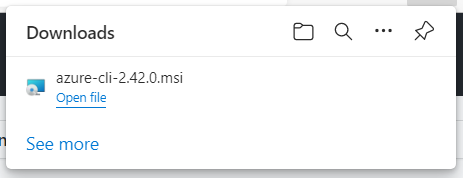
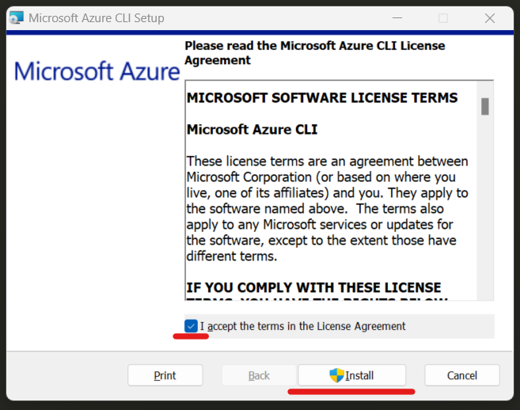
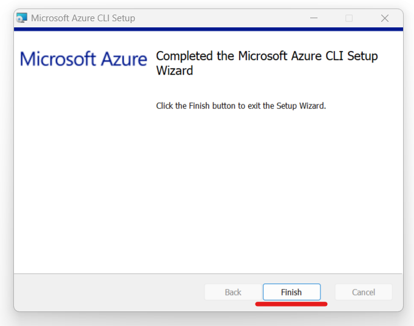
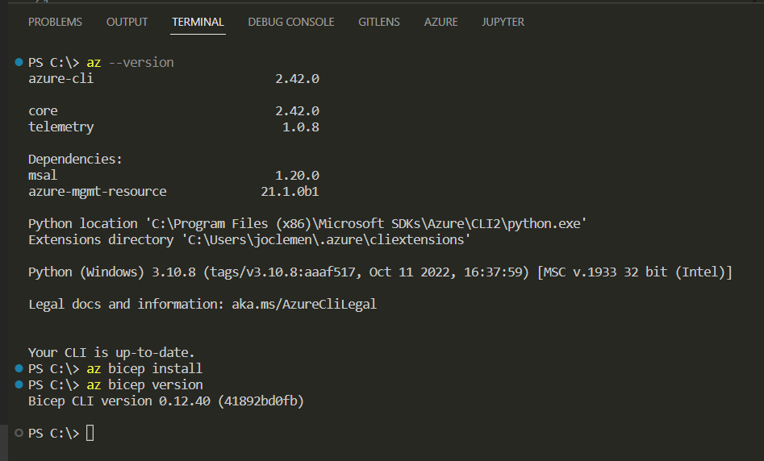
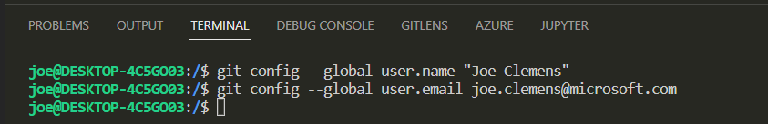
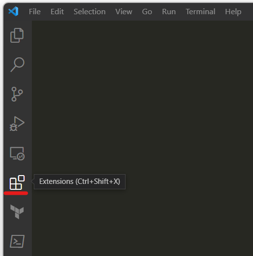

# Module 1: Tooling with Visual Studio Code - Lab01: Configuring Tools

- [Module 1: Tooling with Visual Studio Code - Lab01: Configuring Tools](#module-1-tooling-with-visual-studio-code---lab01-configuring-tools)
  - [Lab01](#lab01)
    - [Install Azure CLI and Bicep](#install-azure-cli-and-bicep)
    - [Install Visual Studio Code](#install-visual-studio-code)
    - [Install Git](#install-git)
      - [Non default selections](#non-default-selections)
      - [Post installation actions](#post-installation-actions)
    - [Install Extensions](#install-extensions)
    - [Try some shortcuts](#try-some-shortcuts)

## Lab01

### Install Azure CLI and Bicep

Obtain the installation [here](https://aka.ms/installazurecliwindows)

```bash
https://aka.ms/installazurecliwindows
```

This link will start a download in your browser. When it is complete, click on "Open file"



Which opens a dialog to install.  
*Note: You may need to wait a few moments for the installer to complete requirements*

Click on the checkbox to accept terms and click on the "Install" button.



When complete, click the "Finish" button.



Next, in the Visual Studio Code (VSCode) Terminal (Powershell or pwsh), enter the following commands:

```bash
az --version
az bicep install
az bicep version
```

Your terminal may look like this.



### Install Visual Studio Code

Install from:
[https://code.visualstudio.com/](https://code.visualstudio.com/)


### Install Git

Install from
[https://git-scm.com/](https://git-scm.com/)


#### Non default selections

```bash
Use the native Windows Secure Channel library
Use Windows' default console window
```

#### Post installation actions

In a bash shell enter the following commands.

You can use the Terminal of VSCode.  Ensure that you have selected a bash shell for the terminal.


In the terminal, enter the following commands (using your name and email address).

```bash
git config --global user.name "first last"
git config --global user.email your_email@domain
```

Your terminal window may look similar to this.



### Install Extensions

In VSCode, on the left navigation, locate the Extension Icon and click it.



Search for, and install the extensions shown here.


### Try some shortcuts


