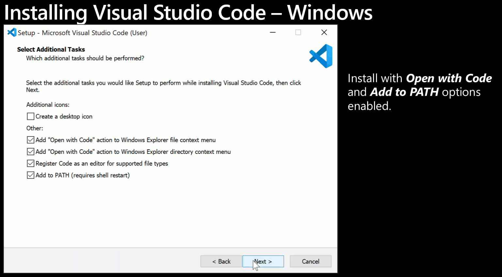
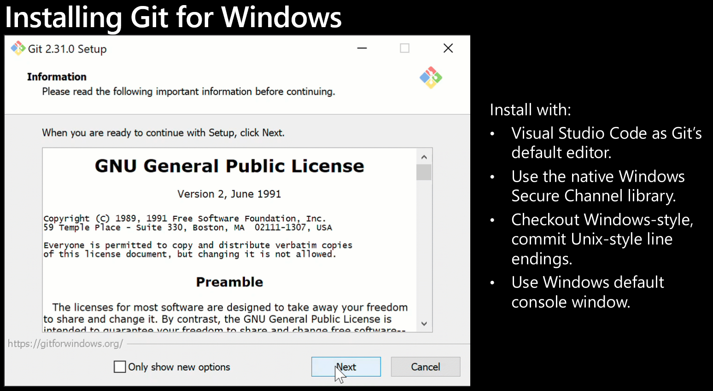
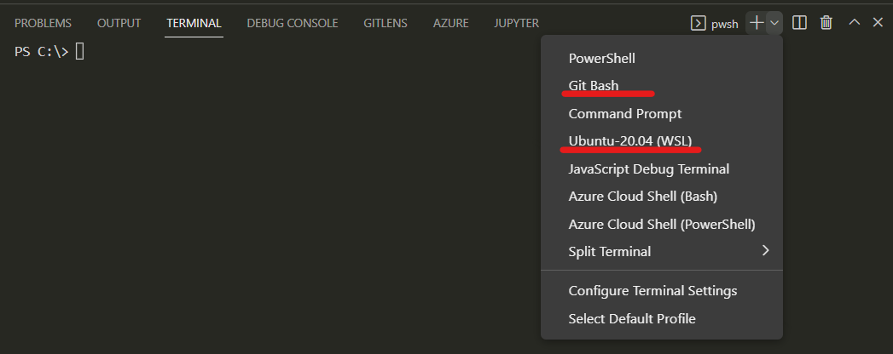
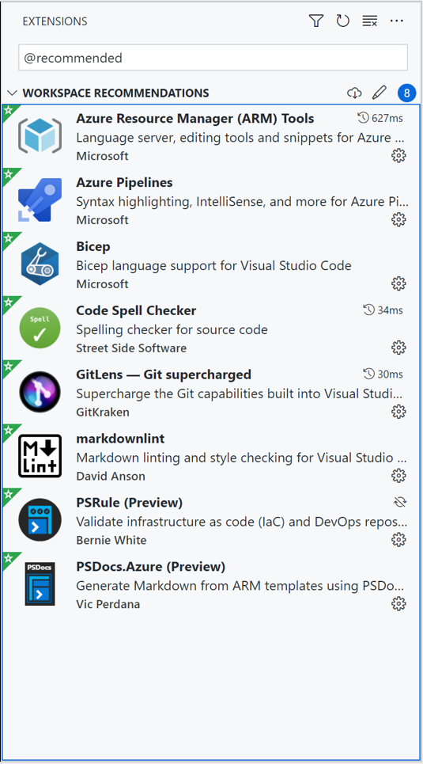
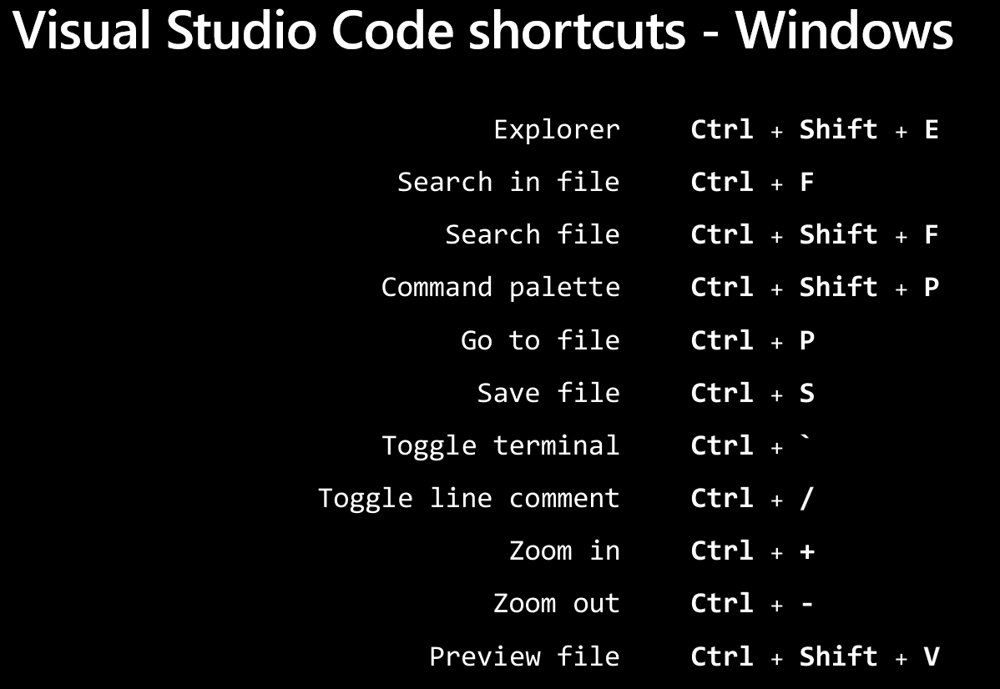

# Module 1: Tooling with Visual Studio Code - Lab01: Configuring Tools

- [Module 1: Tooling with Visual Studio Code - Lab01: Configuring Tools](#module-1-tooling-with-visual-studio-code---lab01-configuring-tools)
  - [Lab01](#lab01)
    - [Install Visual Studio Code](#install-visual-studio-code)
    - [Install Git](#install-git)
      - [Non default selections](#non-default-selections)
      - [Post installation actions](#post-installation-actions)
    - [Install Extensions](#install-extensions)
    - [Try some shortcuts](#try-some-shortcuts)

## Lab01

### Install Visual Studio Code

Install from:
[https://code.visualstudio.com/](https://code.visualstudio.com/)



### Install Git

Install from
[https://git-scm.com/](https://git-scm.com/)



#### Non default selections

```bash
Use the native Windows Secure Channel library
Use Windows' default console window
```

#### Post installation actions

In a bash shell enter the following commands.

You can use the Terminal of VSCode.  Ensure that you have selected a bash shell for the terminal.




```bash
git config --global user.name "first last"
git config --global user.email your_email@domain
```

### Install Extensions



### Try some shortcuts


