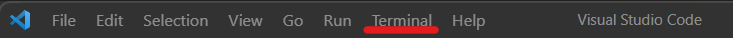
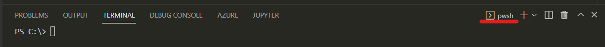

# Module 1: Tooling with Visual Studio Code - Lab01: Configuring Tools

- [Module 1: Tooling with Visual Studio Code - Lab01: Configuring Tools](#module-1-tooling-with-visual-studio-code---lab01-configuring-tools)
  - [Lab01](#lab01)
    - [Install Visual Studio Code](#install-visual-studio-code)
    - [Install Git](#install-git)
      - [Non default selections](#non-default-selections)
      - [Post installation actions](#post-installation-actions)
    - [Install Azure CLI and Bicep](#install-azure-cli-and-bicep)
    - [Install Extensions](#install-extensions)
    - [Try some shortcuts](#try-some-shortcuts)

## Lab01

### Install Visual Studio Code

Install Visual Studio Code (VSCode) from here: [https://code.visualstudio.com/](https://code.visualstudio.com/)


### Install Git

Install from
[https://git-scm.com/](https://git-scm.com/)


#### Non default selections

```bash
Use the native Windows Secure Channel library
Use Windows' default console window
```

#### Post installation actions

Use the Terminal in VSCode.  Ensure that you have selected a bash shell for the terminal.




In the bash shell, enter the following commands (using your name and email address).

```bash
git config --global user.name "first last"
git config --global user.email your_email@domain
```

Your terminal window may look similar to this.


### Install Azure CLI and Bicep

Install Azure CLI for Windows from here: [https://aka.ms/installazurecliwindows](https://aka.ms/installazurecliwindows)

This link will start a download in your browser. When it is complete, click on "Open file"


Which opens a dialog to install.  
*Note: You may need to wait a few moments for the installer to complete requirements*

Click on the checkbox to accept terms and click on the "Install" button.


When complete, click the "Finish" button.


Select PowerShell or pwsh in the VSCode Terminal.



In the VSCode Terminal (Powershell or pwsh), enter the following commands:

```bash
az --version
az bicep install
az bicep version
```

Your terminal may look like this.


### Install Extensions

In VSCode, on the left navigation, locate the Extension Icon and click it.


Search for, and install the extensions shown here.


### Try some shortcuts


You have successfully completed the Lab.
