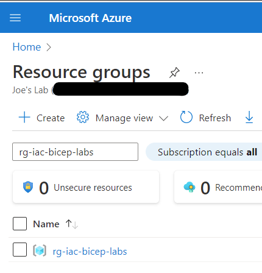

# Module 2: Introduction to Bicep Templates

<!-- markdownlint-disable MD033 -->

- [Module 2: Introduction to Bicep Templates](#module-2-introduction-to-bicep-templates)
  - [Lab01](#lab01)
    - [Prepare for deployments with labs](#prepare-for-deployments-with-labs)
      - [Login to the Azure Platform](#login-to-the-azure-platform)
      - [Create the Resource Group for the Labs](#create-the-resource-group-for-the-labs)
    - [Create a storage account using bicep](#create-a-storage-account-using-bicep)
    - [Deploy resources](#deploy-resources)
    - [Review results](#review-results)

## Lab01

### Prepare for deployments with labs

#### Login to the Azure Platform

```bash
az login
```

#### Create the Resource Group for the Labs

Create the resource group named "rg-iac-bicep-labs" in the East US 2 region within Azure. This resource group will be used throughout all the Labs.

```bash
az group create --name rg-iac-bicep-labs --location eastus2
```

### Create a storage account using bicep

Create or find the file: main.bicep

This Bicep Template uses a parameter for the location that is derived from the Resource Group you are deploying to. It also uses a parameter to construct name starting with "salab" to guarantee that the name is globally unique.  This is a requirement for all Storage Accounts.  A description of this requirement is [here](https://learn.microsoft.com/en-us/azure/storage/common/storage-account-overview#storage-account-name)

```bicep
@description('Location for the storage account.')
param location string = resourceGroup().location

@description('The name of the Storage Account')
param storageAccountName string = 'salab${uniqueString(resourceGroup().id)}'

resource storageAccount 'Microsoft.Storage/storageAccounts@2021-06-01' = {
  name: storageAccountName
  location: location
  sku: {
    name: 'Standard_LRS'
  }
  kind: 'StorageV2'
  properties: {}
}

output storageAccountName string = storageAccountName
output storageAccountId string = storageAccount.id
```

### Deploy resources

Ensure that you are working in the proper lab subdirectory.

You can use the deploy.sh bash script to deploy the main.bicep or use this command:

```bash
az deployment group create --resource-group "rg-iac-bicep-labs" --template-file "main.bicep"
```

### Review results

Use your browser to navigate to your instance of the [Azure Portal](https://portal.azure.com). Click on the three lines in the upper left corner to bring up the main navigation.  


Select Resource groups.


Search for rg-iac-bicep-labs in the Resource Group list.



And click on the name to bring up the pane for that Resource Group and see the new StorageAccount "salab..." in the resource pane.


You have successfully completed the Lab.
