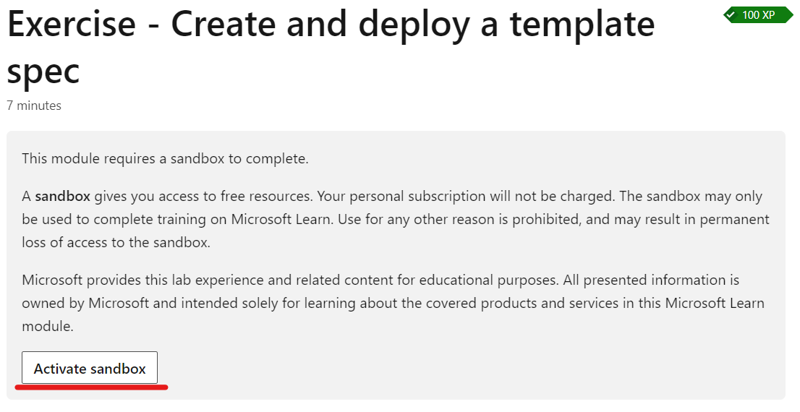
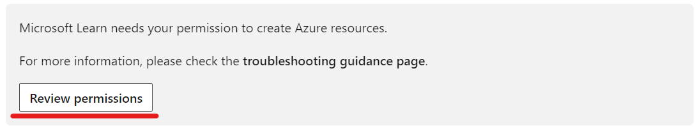
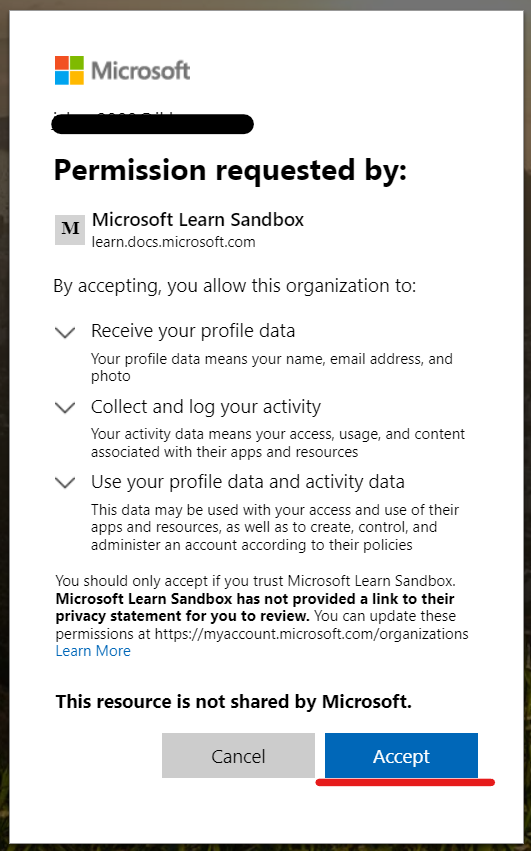
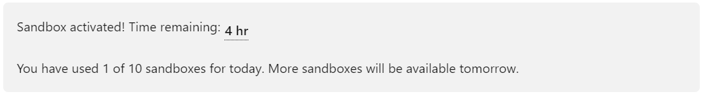
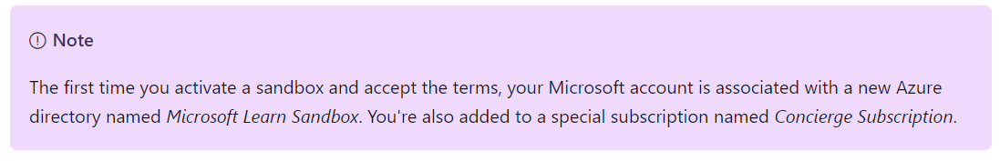
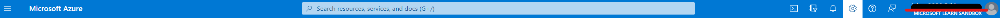
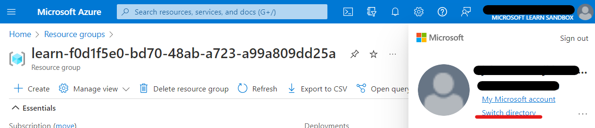
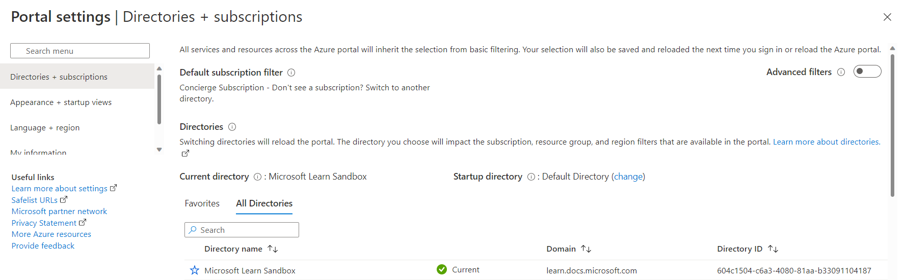

# Pre-Lab

## Azure Sandbox

Azure Sandbox will allow creation of resources outside of your organization.  

Azure Sandbox will exist for 4 consecutive hours.

Learn about Azure Sandbox here [https://learn.microsoft.com/en-us/training/support/faq?pivots=sandbox](https://learn.microsoft.com/en-us/training/support/faq?pivots=sandbox)

### Start an Azure Sandbox

Navigate to the lab guide for [Day 2, Module 8 Lab01](https://github.com/superjoe2000/workshop-iac-bicep-labs/tree/main/labfiles/Day%202/Module%208%20Publish%20reusable%20code%20with%20Template%20Specs/Lab01).

Click on the link to "Follow the lab guide": [Exercise - Create and deploy a template spec](https://learn.microsoft.com/en-au/training/modules/arm-template-specs/5-exercise-create-deploy-template-spec?pivots=bicepcli).

Next click on the button to Activate Sandbox.

Then you will need to select Review permissions.

This will open a browser dialog. Click on Accept.

Once the setup is complete, the page in the browser will contain this.

## Azure Portal

Log into the Azure Portal.  [https://portal.azure.com](https://portal.azure.com)

*Note:  Use the same email address that you selected "Accept" permissions above*

Click on your email address in the upper right corner of the portal site.

Next click on the link to Switch directory.

Switch to the Microsoft Learn Sandbox directory

