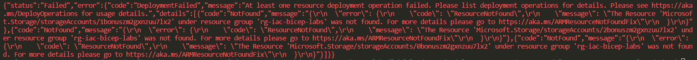

# Module 4: Using Conditions and Loops in a Bicep Template

- [Module 4: Using Conditions and Loops in a Bicep Template](#module-4-using-conditions-and-loops-in-a-bicep-template)
  - [Lab01](#lab01)
    - [Modify Storage account bicep template to deploy in a loop](#modify-storage-account-bicep-template-to-deploy-in-a-loop)
    - [Add a parameter to set the loop count](#add-a-parameter-to-set-the-loop-count)
      - [Add a parameters file](#add-a-parameters-file)
    - [Re-deploy resources](#re-deploy-resources)
    - [Review results](#review-results)
    - [Bonus points – Add a Boolean condition to the loop](#bonus-points--add-a-boolean-condition-to-the-loop)
      - [Re-deploy the bonus template](#re-deploy-the-bonus-template)

## Lab01

### Modify Storage account bicep template to deploy in a loop

The main.bicep from Module 3 Lab01 will be modified.

```bicep
@description('Storage Account type')
@allowed([
  'Premium_LRS'
  'Premium_ZRS'
  'Standard_GRS'
  'Standard_GZRS'
  'Standard_LRS'
  'Standard_RAGRS'
  'Standard_RAGZRS'
  'Standard_ZRS'
])
param storageAccountType string = 'Standard_LRS'

@description('Location for the storage account.')
param location string = resourceGroup().location

@description('The name of the Storage Account')
param storageAccountName string = 'salab${uniqueString(resourceGroup().id)}'

resource storageAccount 'Microsoft.Storage/storageAccounts@2021-06-01' = {
  name: storageAccountName
  location: location
  sku: {
    name: storageAccountType
  }
  kind: 'StorageV2'
  properties: {}
}

output storageAccountName string = storageAccountName
output storageAccountId string = storageAccount.id
```

### Add a parameter to set the loop count

We are adding a loop counter parameter to the Bicep Template.

```bicep
@description('Storage loop counter')
@minValue(1)
param storageLoopCount int = 2
```

Next, we update the resource line to include the loop logic.

```bicep
resource storageAccountLoop 'Microsoft.Storage/storageAccounts@2021-06-01' = [for i in range(0, storageLoopCount): {
```

We have also updated the resource name in the template to storageAccount Loop.  Your template should now look like this:

```bicep
@description('Storage Account type')
@allowed([
  'Premium_LRS'
  'Premium_ZRS'
  'Standard_GRS'
  'Standard_GZRS'
  'Standard_LRS'
  'Standard_RAGRS'
  'Standard_RAGZRS'
  'Standard_ZRS'
])
param storageAccountType string = 'Standard_LRS'

@description('Location for all resources.')
param location string = resourceGroup().location

@description('Storage loop counter')
@minValue(1)
param storageLoopCount int = 2

//loop over the storage account for storageLoopCount and check if we are to deploy a storage account based on a condition
resource storageAccountLoop 'Microsoft.Storage/storageAccounts@2021-06-01' = [for i in range(0, storageLoopCount): {
    name: '${i}storage${uniqueString(resourceGroup().id)}' //dynamic name based on loop
    location: location
    sku: {
      name: storageAccountType
    }
    kind: 'StorageV2'
    properties: {}
}]

//loop over outputs...will error if deployStorageAccount set to false
output storageInfo array = [for i in range(0, storageLoopCount): {
  id: storageAccountLoop[i].id
  name:storageAccountLoop[i].name
  blobEndpoint: storageAccountLoop[i].properties.primaryEndpoints.blob
  status: storageAccountLoop[i].properties.statusOfPrimary
}]
```

#### Add a parameters file

Create or find the file "lab.parameters.json" with the following content:

```json
{
  "$schema": "https://schema.management.azure.com/schemas/2019-04-01/deploymentParameters.json#",
  "contentVersion": "1.0.0.0",
  "parameters": {
    "storageAccountType": {
      "value": "Standard_LRS"
    },
    "storageLoopCount": {
      "value": 3
    }
  }
}
```

### Re-deploy resources

Ensure that you are working in the proper lab subdirectory.

We are now referencing a parameters file: "lab.parameters.json".

You can use the deploy.sh bash script to deploy or use this command:

```bash
az deployment group create --resource-group "rg-iac-bicep-labs" --template-file "main.bicep" --parameters "lab.parameters.json"
```

QUESTION: How many storageAccounts will be deployed?
    A. 1
    B. 2
    C. 3
    D. None of the above

The precedence of parameters either in your template or in a file is described in this [article](https://learn.microsoft.com/en-us/azure/azure-resource-manager/bicep/parameter-files#parameter-name-conflicts)

### Review results

In your browser Azure portal tab, you should see 3 new storage accounts.


### Bonus points – Add a Boolean condition to the loop

Copy the main.bicep file to bonus.bicep.

We are adding a boolean condition parameter to the Bicep Template.

```bicep
@description('Do we deploy the storage account or not?')
param deployStorageAccount bool = false
```

Next, we update the resource line to include the condition logic.

```bicep
resource storageAccountLoop 'Microsoft.Storage/storageAccounts@2021-06-01' = [for i in range(0, storageLoopCount): if (deployStorageAccount) {
```

Your template will now look like this:

```bicep
@description('Storage Account type')
@allowed([
  'Premium_LRS'
  'Premium_ZRS'
  'Standard_GRS'
  'Standard_GZRS'
  'Standard_LRS'
  'Standard_RAGRS'
  'Standard_RAGZRS'
  'Standard_ZRS'
])
param storageAccountType string = 'Standard_LRS'

@description('Location for all resources.')
param location string = resourceGroup().location

@description('Do we deploy the storage account or not?')
param deployStorageAccount bool = false

@description('Storage loop counter')
@minValue(1)
param storageLoopCount int = 2

//loop over the storage account for storageLoopCount and check if we are to deploy a storage account based on a condition
resource storageAccountLoop 'Microsoft.Storage/storageAccounts@2021-06-01' = [for i in range(0, storageLoopCount): if (deployStorageAccount) {
    name: '${i}bonus${uniqueString(resourceGroup().id)}' //dynamic name based on loop
    location: location
    sku: {
      name: storageAccountType
    }
    kind: 'StorageV2'
    properties: {}
}]

output deployOrNot bool = deployStorageAccount
//loop over outputs...will error if deployStorageAccount set to false
output storageInfo array = [for i in range(0, storageLoopCount): {
  id: storageAccountLoop[i].id
  name:storageAccountLoop[i].name
  blobEndpoint: storageAccountLoop[i].properties.primaryEndpoints.blob
  status: storageAccountLoop[i].properties.statusOfPrimary
}]
```

#### Re-deploy the bonus template

You can use the bonus.sh bash script to deploy or use this command:

```bash
az deployment group create --resource-group "rg-iac-bicep-labs" --template-file "bonus.bicep" --parameters "lab.parameters.json"
```

The deployment will fail and present this error:



Change conditional parameter to true in the bonus.bicep file.

```bicep
@description('Do we deploy the storage account or not?')
param deployStorageAccount bool = true
```

Then re-deploy again using the bonus.sh bash script or use this command:

```bash
az deployment group create --resource-group "rg-iac-bicep-labs" --template-file "bonus.bicep" --parameters "lab.parameters.json"
```

You will now see the 3 bonus storage accounts in the resource group.


You have successfully completed the Lab.
