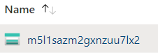
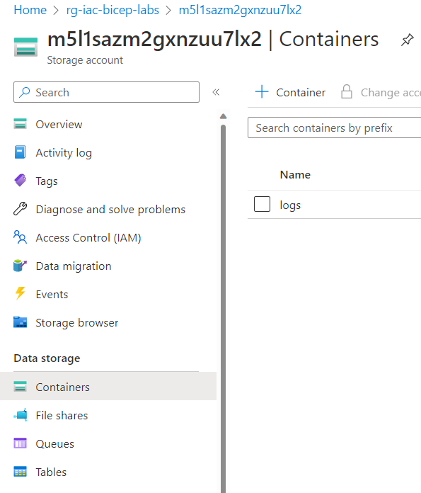

# Module 5 Using Modules in a Bicep Template

<!-- markdownlint-disable MD033 -->

- [Module 5 Using Modules in a Bicep Template](#module-5-using-modules-in-a-bicep-template)
  - [Lab01](#lab01)
    - [Create new Storage account bicep template module](#create-new-storage-account-bicep-template-module)
    - [Create a new Bicep template that calls the new local module](#create-a-new-bicep-template-that-calls-the-new-local-module)
    - [Experiment with parameters](#experiment-with-parameters)
    - [Provision or deploy resources](#provision-or-deploy-resources)
    - [Review results](#review-results)

## Lab01

### Create new Storage account bicep template module

Find or create file storage-module.bicep.

```bicep
param storageAccountName string
param containerName string = 'logs'
param location string = resourceGroup().location

resource storageAccount 'Microsoft.Storage/storageAccounts@2019-06-01' = {
  name: storageAccountName
  location: location
  sku: {
    name: 'Standard_LRS'
  }
  kind: 'StorageV2'
  properties: {
    accessTier: 'Hot'
  }
}

resource container 'Microsoft.Storage/storageAccounts/blobServices/containers@2019-06-01' = {
  name: '${storageAccount.name}/default/${containerName}'
}

@description('Return the Storage Account Resource ID')
output blobResourceId string = storageAccount.id

@description('Return the Storage Account Primary Endpoint')
output blobPrimaryEndpoint string = storageAccount.properties.primaryEndpoints.blob

@description('Return the Storage Account Blob Container Resource ID')
output blobContainerResourceId string = container.id
```

### Create a new Bicep template that calls the new local module

Find or create file main.bicep.

```bicep
//LOCAL Module Reference
@description('Optional. The location to deploy into')
param location string = resourceGroup().location


@description('Generate random storage account name')
param storageAccountName string = 'm5l1sa${uniqueString(resourceGroup().id)}'

module storagemodule './storage-module.bicep' = {  
  name:'stgmod'
  params:{
    storageAccountName:storageAccountName
    location:location
  }
}
```

### Experiment with parameters

The new storage account name is defined in the main.bicep.

```bicep
@description('Generate random storage account name')
param storageAccountName string = 'm5l1sa${uniqueString(resourceGroup().id)}'
```

and is passed to the storage-module.bicep for deployment.

```bicep
param storageAccountName string
```

It is used later in the template.

```bicep
  name: storageAccountName
```

### Provision or deploy resources

Ensure that you are working in the proper lab subdirectory.

We are no longer referencing a parameters file: "lab.parameters.json".

You can use the deploy.sh bash script to deploy or use this command:

```bash
az deployment group create --resource-group "rg-iac-bicep-labs" --template-file "main.bicep"
```

Note that we are also deploying a "Container" resource in the storage account.

### Review results

You will now see the new storage account in the resource group.



Click on the name of the Storage Account to bring up its resource pane. Then click on Containers in the left navigation pane.  You now see a Container named logs within the Storage Account.



You have successfully completed the Lab.
