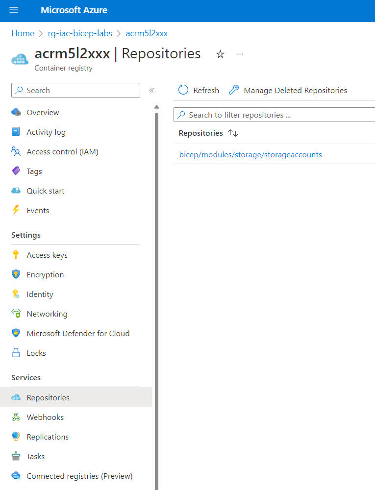
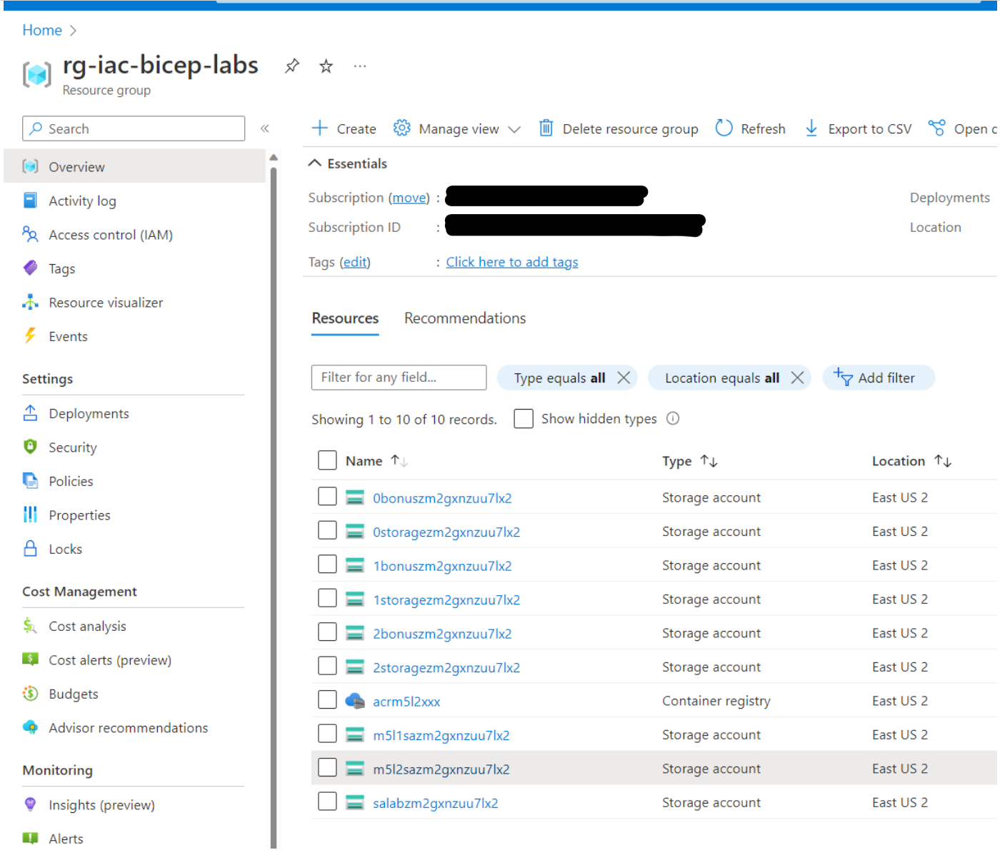

# Module 5 Using Modules in a Bicep Template

## Lab01

In this lab we create an Azure Container Registry and publish a module into it.  Later, we deploy a resource to Azure by referencing the module in the Azure Container Registry.

### Publish Storage Account module from previous lab

Find or create the Storage Account Module file from the previous lab: storage-module.bicep.

```bicep
param storageAccountName string
param containerName string = 'logs'
param location string = resourceGroup().location

resource storageAccount 'Microsoft.Storage/storageAccounts@2019-06-01' = {
  name: storageAccountName
  location: location
  sku: {
    name: 'Standard_LRS'
  }
  kind: 'StorageV2'
  properties: {
    accessTier: 'Hot'
  }
}

resource container 'Microsoft.Storage/storageAccounts/blobServices/containers@2019-06-01' = {
  name: '${storageAccount.name}/default/${containerName}'
}

@description('Return the Storage Account Resource ID')
output blobResourceId string = storageAccount.id

@description('Return the Storage Account Primary Endpoint')
output blobPrimaryEndpoint string = storageAccount.properties.primaryEndpoints.blob

@description('Return the Storage Account Blob Container Resource ID')
output blobContainerResourceId string = container.id
```

### Provision an Azure Container Registry and publish the module

In the acr-main.bicep file change the xxx in the name to something unique.  This is a requirement for all Azure Container Registries.

```bicep
param name string = 'acrm5l2xxx'
```

You also need to change the name in the acr-deploy-publish.sh file.

```bash
acrname="acrm5l2xxx"
```

You can use the acr-deploy-publish.sh bash script to deploy or use these commands:

```bash
resourceGroupName="storage-modules-demo-rg"
location="EastUS2"
acrname="acrm5l2xxx"
moduleReleaseVersion="v1.0.1"
#
az deployment group create --resource-group "rg-iac-bicep-labs" --template-file "acr-main.bicep"
#
az bicep publish --file 'storage-module.bicep' --target br:$acrname.azurecr.io/bicep/modules/storage/storageaccounts:$moduleReleaseVersion
```

In the portal find the Azure Container Registry in the rg-iac-bicep-labs resource group.  Then click on its name and use the left navigation pane to find Repositories.



### Modify Bicep template from previous lab to call remote module

From the main.bicep in the previous lab, we referenced a local file for the module:

```bicep
module storagemodule './storage-module.bicep' = {
```

Now we will modify that to reference the module that is published to the Azure Container Registry acrm5l2xxx (use your unique name).

```bicep
module storage 'br:acrm5l2xxx.azurecr.io/bicep/modules/storage/storageaccounts:v1.0.0'= {
```

Your file should look like this:

```bicep
//REMOTE Module Reference
@description('Optional. The location to deploy into')
param location string = resourceGroup().location

@description('Generate random storage account name')
param storageAccountName string = 'm5l2sa${uniqueString(resourceGroup().id)}'

module storage 'br:acrm5l2xxx.azurecr.io/bicep/modules/storage/storageaccounts:v1.0.0'= {
  name:'demostg'
  params:{
    storageAccountName:storageAccountName
    location:location
  }  
}
```

### Provision or deploy resources

Ensure that you are working in the proper lab subdirectory.

You can use the deploy.sh bash script to deploy or use this command:

```bash
az deployment group create --resource-group "rg-iac-bicep-labs" --template-file "main.bicep"
```

### Review results

In the portal you will now find the new storage account.



You have successfully completed the Lab.
